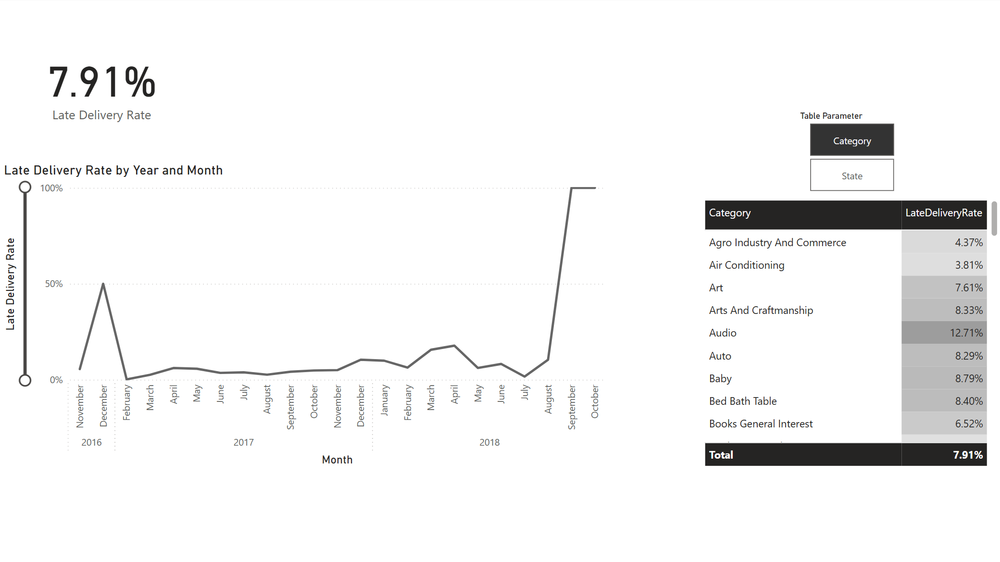

## Вступ
Для дослідження була використана частина Бразильського публічного датасету електронної комерції про замовлення, зроблені в Olist Store - (https://www.kaggle.com/datasets/terencicp/e-commerce-dataset-by-olist-as-an-sqlite-database/data), а саме стовпчики:

Таблиця Olist\_orders_dataset (orders):
* order_id - унікальний ідентифікатор замовлення
* order_status - статус замовлення (delivered, shipped, та ін.)
* order\_delivered\_customer_date - фактична дата доставки до клієнта
* order\_estimated\_delivery_date - оцінений час доставки до клієнта, вказаний під час оформлення покупки
* order\_purchase_timestamp - точний час оформлення покупки

Таблиця olist\_customers_dataset (customers):
* customer_state - штат клієнта

Таблиця olist\_order\_payments\_dataset (order_payments):
* payment_value - розмір транзакції, бралильський реал, R$

Таблиця product\_category\_name_translation:
* product\_category\_name_english - назва категорії товару англійською

На основі цих стовпчиків були створені два датасети - для дослідження кількості замовлень та доходу (Orders\_analysis.csv) та дослідження відсотку замовлень, що були доставлені пізніше за оцінений час доставки (Delivery\_analysis.csv).

## Зміст
[Відбір та завантаження даних](#відбір-та-завантаження-даних)\
[Створення нових таблиць, стовпчиків та мір](#створення-нових-таблиць-стовпчиків-та-мір-з-використанням-мови-dax)\
[Фінальний вигляд дашбордів](#фінальний-вигляд-дашбордів)

## Відбір та завантаження даних
Датасет Orders\_analysis.csv був створений за допомогою SQL-запиту у середовищі DBeaver та експортований у форматі .csv:
``` sql
SELECT 
	o.order_id,
	pcnt.product_category_name_english,
	c.customer_state,
	o.order_status,
	o.order_purchase_timestamp,
	o.order_delivered_customer_date,
	o.order_estimated_delivery_date
FROM orders o
LEFT JOIN order_items oi ON o.order_id = oi.order_id 
LEFT JOIN products p ON oi.product_id = p.product_id 
LEFT JOIN product_category_name_translation pcnt ON p.product_category_name = pcnt.product_category_name 
LEFT JOIN customers c ON o.customer_id = c.customer_id 
```

Датасет Delivery\_analysis.csv створений таким самим шляхом за допомогою наступного запиту:
``` sql
SELECT 
	o.order_id,
	o.order_status,
	op.payment_value,
	o.order_purchase_timestamp,
	customer_state 
FROM orders o 
LEFT JOIN order_payments op ON op.order_id = o.order_id 
LEFT JOIN customers c ON o.customer_id = c.customer_id 
GROUP BY o.order_id 
```

Дані після імпорту та приведення значень до більш читабельного вигляду у MS Power BI:\
Orders\_analysis:\
\
Delivery\_analysis:\


## Створення нових таблиць, стовпчиків та мір з використанням мови DAX
### Таблиця Calendar
Створена для візуалізацій, що базуються часі:
```
Calendar = ADDCOLUMNS(
    CALENDAR( MIN(Delivery_analisys[order_purchase_timestamp]), MAX(Delivery_analisys[order_delivered_customer_date]) )
    , "Year", YEAR([Date])
    , "Quarter", QUARTER([Date])
    , "Month", MONTH([Date])
    , "MonthName", FORMAT([Date], "Mmmm")
    , "Day", DAY([Date])
    , "DayText", FORMAT([Date], "d")
    )
```
### Стовпчики та міри, додані до Delivery_analysis:
\
Стовпчик, що дублює початковий стовпчик з категоріями товарів, але додає катеорію "Other" для порожніх позицій:
```
CategoryOtherAdded = IF(ISBLANK(Delivery_analisys[product_category_name_english]), "Other", Delivery_analisys[product_category_name_english])
```

Стовпчик, що приймає значення True або False у випадках коли зафіксоване запізнення доставки:
```
Deliv later then estim = Delivery_analisys[order_estimated_delivery_date] < Delivery_analisys[order_delivered_customer_date]
```
Стовпчик, що копіює тільки дату зі стовпчика order\_delivered\_customer\_date (фактична доставка клієнту), а у випадку якщо цей стовпчик порожній - копіює дату із стовпчика order\_purchase\_timestamp(час оформлення замовлення) для зв'язку таблиці з таблицею Calendar:
```
OrderDeliveredDate = 
IF(Delivery_analisys[order_status] = "delivered",
    IF(ISBLANK(Delivery_analisys[order_delivered_customer_date]),
        DATE(
            YEAR(Delivery_analisys[order_purchase_timestamp]), 
            MONTH(Delivery_analisys[order_purchase_timestamp]), 
            DAY(Delivery_analisys[order_purchase_timestamp])
        ),
        DATE(
            YEAR(Delivery_analisys[order_delivered_customer_date]), 
            MONTH(Delivery_analisys[order_delivered_customer_date]), 
            DAY(Delivery_analisys[order_delivered_customer_date])
        )
    )
)
```
Стовпчики CategoryOtherAdded, DelivLaterThenEstim та OrderDeliveredDate:\ 
\
Міра LateDeliveryRate, що рахує частку доставок із запізненнями(порівняно з оціненим часом доставки) серед замовлень із статусом delivered:
```
LateDeliveryRate = 
VAR TotalOrders = CALCULATE(
    COUNTROWS(Delivery_analisys),
    Delivery_analisys[order_status] = "delivered"
)
VAR LateOrders = CALCULATE(
    COUNTROWS(Delivery_analisys),
    Delivery_analisys[Deliv later then estim] = TRUE(),
    Orders_analisys[order_status] = "delivered"
)
RETURN 
    IF(TotalOrders = 0, BLANK(), LateOrders / TotalOrders)
```
### Стовпчики та міри, додані до Orders_analysis:
Стовпчик, що копіює тільки дату із стовпчика order\_purchase\_timestamp(час оформлення замовлення)
```
OrderPurchaseDate = 
    DATE(
        YEAR(Orders_analisys[order_purchase_timestamp]), 
        MONTH(Orders_analisys[order_purchase_timestamp]), 
        DAY(Orders_analisys[order_purchase_timestamp])
    )
```
Стовпчик, виводит відповідну повну назву штату зі скороченої форми, що є у датасеті:
```
Full State Name = 
SWITCH(
    Orders_analisys[customer_state],
    "AC", "Acre",
    "AL", "Alagoas",
    "AP", "Amapa",
    "AM", "Amazonas",
    "BA", "Bahia",
    "CE", "Ceara",
    "DF", "Distrito Federal",
    "ES", "Espirito Santo",
    "GO", "Goias",
    "MA", "Maranhao",
    "MT", "Mato Grosso",
    "MS", "Mato Grosso do Sul",
    "MG", "Minas Gerais",
    "PA", "Para",
    "PB", "Paraiba",
    "PR", "Parana",
    "PE", "Pernambuco",
    "PI", "Piaui",
    "RJ", "Rio de Janeiro",
    "RN", "Rio Grande do Norte",
    "RS", "Rio Grande do Sul",
    "RO", "Rondonia",
    "RR", "Roraima",
    "SC", "Santa Catarina",
    "SP", "Sao Paulo",
    "SE", "Sergipe",
    "TO", "Tocantins",
    "Unknown")
```
\
Міра Average Check:
```
Average Check = SUM(Orders_analisys[payment_value]) / COUNT(Orders_analisys[order_id])
```
Міра Orders Amount:
```
Orders Amount = COUNT(Orders_analisys[order_id])
```
Міра Total Payment Sum:
```
Total Payment Sum = SUM(Orders_analisys[payment_value])
```
Також були створені параметри для вибору різних стовпчиків даних у одній візуалізації:
Map Parameter:
```
Map Parameter = {
    ("Average Check", NAMEOF('Orders_analisys'[Average Check]), 0),
    ("Orders Amount", NAMEOF('Orders_analisys'[Orders Amount]), 1),
    ("Total Payment Sum", NAMEOF('Orders_analisys'[Total Payment Sum]), 2)
}
```
Table Parameter
```
Table Parameter = {
    ("Category", NAMEOF('Delivery_analisys'[CategoryOtherAdded]), 0),
    ("State", NAMEOF('Delivery_analisys'[customer_state]), 1)
}
```
Модель даних, що вийшла:


## Фінальний вигляд дашбордів
### Дашборд Orders:

Дашборд скаладається з: 
* трьох карток, що демонструють основні показинки - кількість замовлень, суму, сплачену клієнтами за придбані товари та середній чек
* інтеркативної мапи Бразилії, розділеної за штатами з можливістю обрати бажаний показник, що буде візуалізований на цій мапі
* двох графіків, що показують залежність суми, сплаченої клієнтами за придбані товари та кількість замовлень від часу - є можливість оцінити щомісячну динаміку за роками та незалежно від років.

Основний фільтр тут - меню, що випадає, де можна обрати статус товару(delivered, approved, created, canceled ті ін.)  

Дашборд зі зміненими фільтрами:


### Дашборд Delivery:

Дашборд скаладається з: 
* однієї картки, що відображає частку доставок із запізненням
* таблиці, що показує частку доставок із запізненням в залежності від категорії товару або від штату
* графіку, який дозволяє відслідковувати зміну у кількості доставок із запізненням щомісяця за роками та незалежно від років

Дашборд зі зміненими фільтрами:


