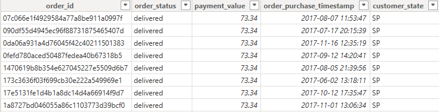
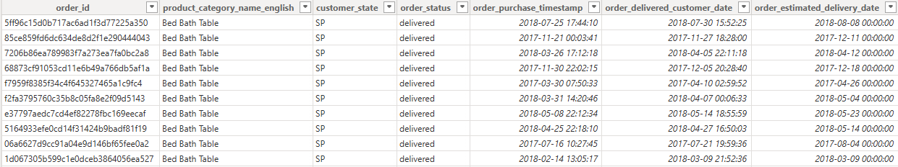
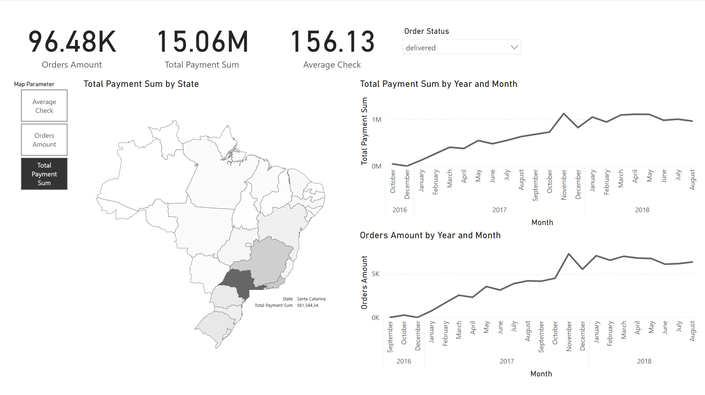
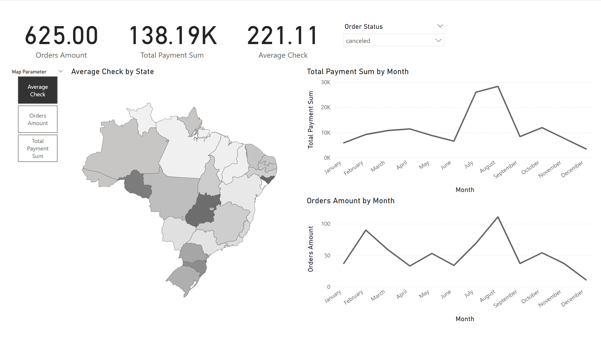

## Introduction
The analysis was based on a part of the Brazilian ecommerce public dataset of orders made at Olist Store - (https://www.kaggle.com/datasets/terencicp/e-commerce-dataset-by-olist-as-an-sqlite-database/data), in particular, columns:

Table Olist\_orders_dataset (orders):
* order_id - unique identifier of the order
* order_status - reference to the order status (delivered, shipped, etc)
* order\_delivered\_customer_date - shows the actual order delivery date to the customer
* order\_estimated\_delivery_date - shows the estimated delivery date that was informed to customer at the purchase moment
* order\_purchase_timestamp - shows the purchase timestamp

Table olist\_customers_dataset (customers):
* customer_state - customer state

Table olist\_order\_payments\_dataset (order_payments):
* payment_value - transaction value, Brazilian real, R$

Table product\_category\_name_translation:
* product\_category\_name_english - category name in English

Based on these columns, two datasets were created - to examine the number of orders and revenue (Orders\_analysis.csv) and to examine the fraction of orders that were delivered later than the estimated delivery time (Delivery\_analysis.csv).

## Introduction
[Data selection and uploading](#data-selection-and-uploading)\
[Creating new tables, columns, and measures using DAX](#creating-new-tables-columns-and-measures-using-dax)\
[The complete look of dashboards](#the-complete-look-of-dashboards)

## Data selection and uploading
The Orders\_analysis.csv dataset was created using a SQL query in DBeaver and exported from it in .csv format:
``` sql
SELECT 
	o.order_id,
	pcnt.product_category_name_english,
	c.customer_state,
	o.order_status,
	o.order_purchase_timestamp,
	o.order_delivered_customer_date,
	o.order_estimated_delivery_date
FROM orders o
LEFT JOIN order_items oi ON o.order_id = oi.order_id 
LEFT JOIN products p ON oi.product_id = p.product_id 
LEFT JOIN product_category_name_translation pcnt ON p.product_category_name = pcnt.product_category_name 
LEFT JOIN customers c ON o.customer_id = c.customer_id 
```

The Delivery\_analysis.csv dataset is created in the same way using the following query:
``` sql
SELECT 
	o.order_id,
	o.order_status,
	op.payment_value,
	o.order_purchase_timestamp,
	customer_state 
FROM orders o 
LEFT JOIN order_payments op ON op.order_id = o.order_id 
LEFT JOIN customers c ON o.customer_id = c.customer_id 
GROUP BY o.order_id 
```

Data after importing and adjusting the values to a more readable form in MS Power BI:\.
Orders\_analysis:\
\
Delivery\_analysis:\


## Creating new tables, columns, and measures using DAX
### Calendar table
Created for time-based visualizations:
```
Calendar = ADDCOLUMNS(
    CALENDAR( MIN(Delivery_analisys[order_purchase_timestamp]), MAX(Delivery_analisys[order_delivered_customer_date]) )
    , "Year", YEAR([Date])
    , "Quarter", QUARTER([Date])
    , "Month", MONTH([Date])
    , "MonthName", FORMAT([Date], "Mmmm")
    , "Day", DAY([Date])
    , "DayText", FORMAT([Date], "d")
    )
```
### Columns and measures added to Delivery_analysis table:
\
A column that duplicates the original column with product categories, but adds the “Other” category for empty fields:
```
CategoryOtherAdded = IF(ISBLANK(Delivery_analisys[product_category_name_english]), "Other", Delivery_analisys[product_category_name_english])
```

Column which takes the True and False values in cases when the delivery is late:
```
Deliv later then estim = Delivery_analisys[order_estimated_delivery_date] < Delivery_analisys[order_delivered_customer_date]
```
A column that copies only the date from the order\_delivered\_customer\_date column (actual delivery to the customer), and if this column is empty, copies the date from the order\_purchase\_timestamp column (time of ordering) to link the table with the Calendar table:
```
OrderDeliveredDate = 
IF(Delivery_analisys[order_status] = "delivered",
    IF(ISBLANK(Delivery_analisys[order_delivered_customer_date]),
        DATE(
            YEAR(Delivery_analisys[order_purchase_timestamp]), 
            MONTH(Delivery_analisys[order_purchase_timestamp]), 
            DAY(Delivery_analisys[order_purchase_timestamp])
        ),
        DATE(
            YEAR(Delivery_analisys[order_delivered_customer_date]), 
            MONTH(Delivery_analisys[order_delivered_customer_date]), 
            DAY(Delivery_analisys[order_delivered_customer_date])
        )
    )
)
```
Columns CategoryOtherAdded, DelivLaterThenEstim and OrderDeliveredDate:
\
LateDeliveryRate measure, which calculates the share of late deliveries (compared to the estimated delivery time) among orders with a delivered status:
```
LateDeliveryRate = 
VAR TotalOrders = CALCULATE(
    COUNTROWS(Delivery_analisys),
    Delivery_analisys[order_status] = "delivered"
)
VAR LateOrders = CALCULATE(
    COUNTROWS(Delivery_analisys),
    Delivery_analisys[Deliv later then estim] = TRUE(),
    Orders_analisys[order_status] = "delivered"
)
RETURN 
    IF(TotalOrders = 0, BLANK(), LateOrders / TotalOrders)
```
### Columns and measures added to Orders_analysis:
A column that copies only the date from the order\_purchase\_timestamp column (time of order placement)
```
OrderPurchaseDate = 
    DATE(
        YEAR(Orders_analisys[order_purchase_timestamp]), 
        MONTH(Orders_analisys[order_purchase_timestamp]), 
        DAY(Orders_analisys[order_purchase_timestamp])
    )
```
Column that displays the corresponding full name of the state from the abbreviated form available in the dataset:
```
Full State Name = 
SWITCH(
    Orders_analisys[customer_state],
    "AC", "Acre",
    "AL", "Alagoas",
    "AP", "Amapa",
    "AM", "Amazonas",
    "BA", "Bahia",
    "CE", "Ceara",
    "DF", "Distrito Federal",
    "ES", "Espirito Santo",
    "GO", "Goias",
    "MA", "Maranhao",
    "MT", "Mato Grosso",
    "MS", "Mato Grosso do Sul",
    "MG", "Minas Gerais",
    "PA", "Para",
    "PB", "Paraiba",
    "PR", "Parana",
    "PE", "Pernambuco",
    "PI", "Piaui",
    "RJ", "Rio de Janeiro",
    "RN", "Rio Grande do Norte",
    "RS", "Rio Grande do Sul",
    "RO", "Rondonia",
    "RR", "Roraima",
    "SC", "Santa Catarina",
    "SP", "Sao Paulo",
    "SE", "Sergipe",
    "TO", "Tocantins",
    "Unknown")
```
\
Average Check measure:
```
Average Check = SUM(Orders_analisys[payment_value]) / COUNT(Orders_analisys[order_id])
```
Orders Amount measure:
```
Orders Amount = COUNT(Orders_analisys[order_id])
```
Total Payment Sum measure:
```
Total Payment Sum = SUM(Orders_analisys[payment_value])
```
Options were also created to select different columns of data in one visual:
Map Parameter:
```
Map Parameter = {
    ("Average Check", NAMEOF('Orders_analisys'[Average Check]), 0),
    ("Orders Amount", NAMEOF('Orders_analisys'[Orders Amount]), 1),
    ("Total Payment Sum", NAMEOF('Orders_analisys'[Total Payment Sum]), 2)
}
```
Table Parameter
```
Table Parameter = {
    ("Category", NAMEOF('Delivery_analisys'[CategoryOtherAdded]), 0),
    ("State", NAMEOF('Delivery_analisys'[customer_state]), 1)
}
```
The resulting data model:


## The complete look of dashboards
### Orders dashboard:

The dashboard consists of:
* three cards demonstrating the main indicators - the amount of orders, the amount paid by customers for the purchased goods and the average check
* an interactive map of Brazil divided by states with the ability to select the desired indicator to be visualized on this map
* two graphs showing changes in the amount paid by customers for purchased goods and the number of orders over time - it is possible to assess monthly dynamics by year and regardless of year.

The main filter here is a drop-down menu where you can select the status of the product (delivered, approved, created, canceled, etc.)

Dashboard with changed filter settings:


### Delivery dashboard:

The dashboard consists of:
* one card showing the rate of late deliveries
* a table showing the rate of late deliveries by product category or state
* гa graph that allows you to track changes in the number of late deliveries on a monthly basis by year and regardless of year 

Dashboard with changed filter settings:


